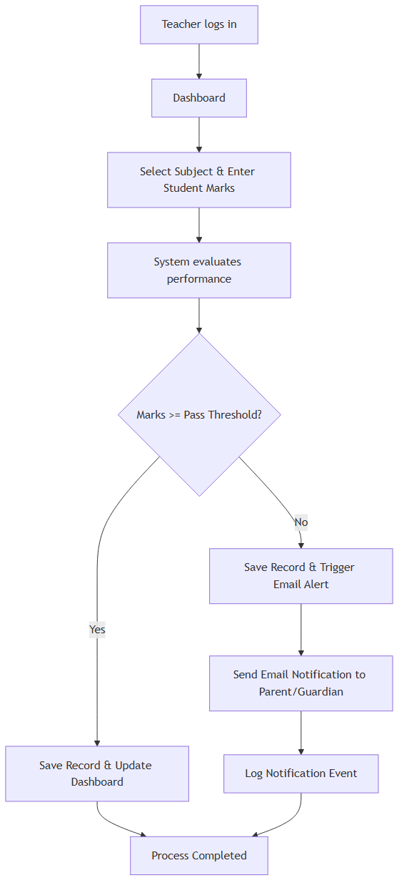
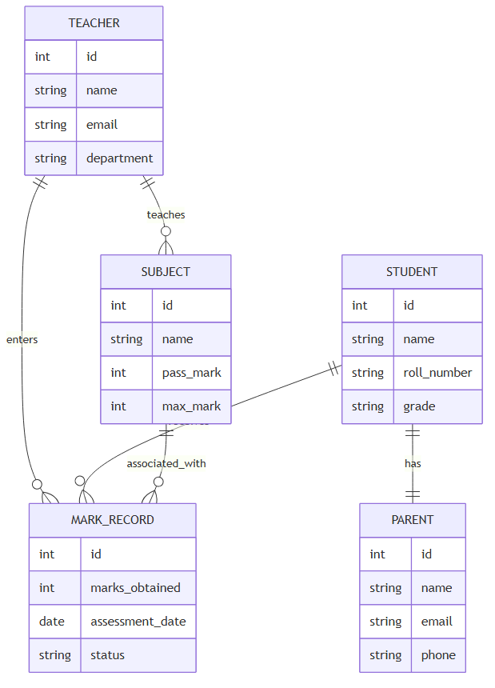

# Real-Time Academic Performance Tracking System

<div style="page-break-before: always;"></div>

# CHAPTER I
# INTRODUCTION

<div style="page-break-before: always;"></div>

## 1.1 An Overview
In the contemporary educational landscape, accurate and timely communication of student academic progress forms the absolute baseline of any robust institutional framework. As educational institutions and individuals increasingly rely on interconnected digital systems to process, store, and transmit sensitive academic data, the traditional methods of manual record-keeping have proven increasingly inadequate. Educational environments are faced with challenges such as maintaining physical records, spreadsheets, or delayed reporting systems, which represent significant risks to data integrity, availability, and the swift identification of struggling students. To mitigate these administrative burdens and communication gaps, centralized performance monitoring systems act as the primary line of coordination, sitting at the core of an institution's operations to monitor, evaluate, and report academic metrics based on predetermined pass criteria.

Traditional monitoring methods, historically reliant on manual "stateless" grading and reporting, evaluate student progress on a delayed, periodic basis. These systems inspect the results of individual assessments—such as mid-term exams, assignments, and final papers—against a static set of passing criteria, but the dissemination of this information is often slow. While conceptually simple and familiar, manual systems lack the real-time context of a broader academic trajectory. They cannot instantly determine if a student's recent failing grade is part of a broader pattern of academic decline or an isolated incident. This inherent limitation leaves institutions vulnerable to delayed interventions, resulting in poorer educational outcomes and dissatisfied parents who feel excluded from their child's educational journey.

To address these vulnerabilities, the concept of Real-Time Academic Performance Tracking with Automated Email Alerts was developed. Modern academic systems not only inspect the individual assessment scores but also track the continuous state of student performance. By maintaining a dynamic and centralized "state table" of marks, these digital platforms can contextualize academic progress. For example, in a modern assessment communication, the system tracks the entire lifecycle of the grading process—from the initial entry of marks by the teacher, through the automated evaluation phase, and finally to the immediate notification of parents if thresholds are not met. If a newly entered mark falls below the required passing threshold, the system instantly cross-references the student's guardian contact details and triggers an alert.

The Real-Time Academic Performance Tracking System was conceived as an advanced, centralized digital platform designed to improve how institutions monitor and manage data. While some environments rely on bloated, legacy Enterprise Resource Planning (ERP) software, this project serves as a comprehensive demonstration of how automated evaluation, rule-based alerts, and centralized data management operate at a programmatic level using modern, lightweight web frameworks. The project simulates a robust administrative ecosystem, complete with secure teacher logins, structured mark entry interfaces, asynchronous email dispatching, and automated academic status evaluation. By building this system from the ground up using FastAPI and modern frontend technologies, the project provides deep insights into the mechanics of web-based data management, asynchronous Python programming, and the architectural design of modern educational software.

<div style="page-break-before: always;"></div>

## 1.2 Objectives of the Project
The development of the Student's Performance Monitoring System is driven by several core objectives, designed to create a functional, reliable, and highly observable administrative tool. These objectives span both the theoretical understanding of institutional data management and the practical engineering of a high-performance web application.

- **Real-Time Data Processing and Evaluation:** The primary objective is to implement a robust backend capable of receiving, storing, and immediately evaluating student marks against predefined subject-specific pass criteria.
- **Automated Communication Mechanisms:** To develop a flexible and reliable notification engine that automatically dispatches email alerts to registered parents or guardians whenever a student's performance falls below acceptable thresholds, ensuring timely interventions.
- **User-Friendly Data Entry Interface:** To provide teachers and administrators with a responsive, intuitive frontend environment constructed with HTML, CSS, and JavaScript. This reduces the friction associated with bulk data entry and minimizes manual human error.
- **Comprehensive Observability and Logging:** A tracking system is only as good as the visibility it provides. The project aims to implement structured logging for all data entries and email dispatches, ensuring full accountability.
- **Cross-Platform Accessibility:** Recognizing that teachers access systems from various devices, the project aims to run seamlessly across desktops, tablets, and mobile browsers without requiring specialized client-side software.
- **Security and Authorization:** Because academic records are highly sensitive, the internal databases and endpoints must be strictly protected. The objective is to utilize robust authentication mechanisms to ensure only authorized personnel can enter or alter marks.

<div style="page-break-before: always;"></div>

## 1.3 Scope of the System
The scope of the Student's Performance Monitoring System defines the boundaries of its implementation, establishing what the system is designed to do and, equally importantly, what it intentionally omits to maintain focus, usability, and performance.

**In-Scope Features:**
- **Mark Entry and Evaluation:** The system handles the entry of marks for specific subjects and immediately evaluates them against dynamic passing criteria defined by the administrator.
- **Automated Email Notifications:** The project includes a dedicated asynchronous email dispatcher module that formats and sends alerts using SMTP when failure criteria are met.
- **User Authentication:** Secure login functionality for teachers and administrators to prevent unauthorized access to student records.
- **Responsive Dashboard:** A web-based user interface that adapts to various screen sizes, providing a clear overview of student performance metrics.
- **Student and Parent Directory:** A centralized database mapping students to their respective subjects, grades, and parent contact information (emails and phone numbers).

**Out-of-Scope Features:**
- **Financial and Fee Management:** The current implementation acts strictly as an academic performance tracking platform. It does not handle tuition fee processing, invoicing, or payroll management.
- **Timetable and Scheduling:** The system does not generate complex institutional timetables or manage physical classroom allocations.
- **Advanced Predictive Analytics:** While the system alerts users to current failures, it does not currently employ machine learning models to predict future student drop-out rates or provide highly advanced statistical regressions.
- **Graphical User Interface (GUI) Desktop Client:** The system is intentionally designed as a Web Application. It prioritizes accessibility via modern web browsers over operating-system-specific desktop applications.

<div style="page-break-before: always;"></div>

# CHAPTER II
# SYSTEM ANALYSIS

<div style="page-break-before: always;"></div>

## 2.1 Existing System
In many legacy educational environments, academic tracking relies on traditional or semi-manual methods. Systems utilizing physical ledgers, disconnected spreadsheets, and delayed physical report cards represent the existing baseline. In a manual system, the teacher evaluates each student's performance in complete isolation. When an exam is graded, the teacher writes the marks in a register or types them into a standalone Excel file. These files are then periodically merged, printed, and distributed during parent-teacher meetings or mailed home at the end of the term.

**Drawbacks of the Existing System:**
- **Lack of Timely Communication:** Because a manual system relies on end-of-term reporting, parents are often unaware of a student's struggles until it is too late to intervene effectively during the academic cycle.
- **Vulnerability to Data Loss and Human Error:** Teachers organizing large amounts of academic data via physical records or fragmented spreadsheets are prone to transcription errors, and physical documents can be easily misplaced or damaged.
- **Inefficient Administrative Workload:** In a traditional system, every single report card—even for a massive cohort of students—must be manually compiled, verified, and distributed. This labor-intensive process creates significant bottlenecks and distracts teachers from their primary instructional duties.
- **Susceptibility to Information Silos:** Basic spreadsheets do not provide centralized access. If a parent calls the school office to inquire about a student's sudden decline in performance, the administrator may not have access to the specific teacher's local spreadsheet, leading to poor institutional responsiveness.

<div style="page-break-before: always;"></div>

## 2.2 Proposed System
The Proposed System fundamentally shifts the paradigm from isolated manual record-keeping to holistic, real-time academic tracking. By introducing a robust centralized database, a dynamic web interface, and an automated alerting mechanism, the proposed system resolves the critical vulnerabilities present in the existing manual architecture.

**Advantages of the Proposed System:**
- **Dynamic Real-Time Evaluation:** The core innovation is the immediate processing of marks. When a teacher inputs a grade, the system instantly checks the database, verifies the pass threshold, and calculates the academic status. This completely eliminates the multi-week delay in performance evaluation.
- **Automated Communication:** Because the system integrates an SMTP email dispatcher, the expensive, top-to-bottom manual process of drafting letters to parents is bypassed entirely. Once a failure is detected, an email is formulated and dispatched asynchronously in the background, resulting in dramatically improved parental engagement.
- **Centralized Accessibility:** Utilizing modern web development technologies ensures that administrators, principals, and teachers all view the same, up-to-date data. This single source of truth shields the institution from miscommunication and fragmented information silos.
- **Advanced Web Semantics:** The proposed system allows teachers to enter data with extreme precision through structured web forms. The inclusion of client-side validation condenses error-checking into a seamless user experience, preventing typos or invalid data from ever reaching the server.
- **Observability and Accountability:** Every mark entry in the proposed system maintains an atomic record of who entered it and when. Administrators can instantly see which teachers have completed their grading and which are pending.

<div style="page-break-before: always;"></div>

## 2.3 Hardware Specification
Because the Student's Performance Monitoring System is designed as a web-based architecture, its hardware requirements are split between the hosting server and the client machines. The following specifications outline the requirements for a standard deployment capable of handling a small-to-medium educational institution.

**Server Hardware Requirements:**
- **Processor:** Multi-core CPU (Intel Core i5 / i7, AMD Ryzen 5+, or modern cloud server equivalents), 2.5 GHz or higher. Multi-threading is highly beneficial as the FastAPI framework operates highly concurrent, asynchronous data processing.
- **Memory (RAM):** 4 GB or higher. A moderate volume of concurrent connections requires RAM for the database caching and asynchronous worker processes.
- **Storage:** High-speed Solid State Drive (SSD) for low-latency database queries and JSON log writes (Minimum 50 GB).
- **Network Interface:** Dedicated Gigabit (10/100/1000 Mbps) network connection for rapid API response times.

**Client Hardware Requirements (Teachers/Administrators):**
- **Processor:** Standard modern processor capable of running a modern web browser.
- **Memory (RAM):** 2 GB minimum.
- **Display:** Standard monitor, tablet, or smartphone screen capable of rendering HTML5/CSS3 effectively.

<div style="page-break-before: always;"></div>

## 2.4 Software Specification
The application is built upon a high-performance modern tech stack, ensuring maximum portability and speed across different operating systems. The software stack leverages modern Python features (like Pydantic, asynchronous I/O) to ensure a clean, maintainable backend.

**Core Requirements:**
- **Operating System (Server):** Cross-platform support. Fully compatible with Linux (Ubuntu, Debian, CentOS), Windows (10, Server), and macOS. Linux is recommended for production deployment due to the superior performance of Uvicorn/Gunicorn.
- **Programming Language (Backend):** Python 3.10 or higher. The project relies heavily on Python's advanced asynchronous typing system and the FastAPI framework.
- **Frontend Technologies:** HTML5, CSS3, and JavaScript (Vanilla or lightweight framework).

**Dependency Libraries:**
- **FastAPI:** The core web framework chosen for its speed and native support for asynchronous programming.
- **Uvicorn:** An ASGI web server implementation for Python.
- **SQLAlchemy:** An SQL toolkit and Object-Relational Mapper (ORM) for Python, used to interact with the database (e.g., SQLite or PostgreSQL).
- **Pydantic:** Data validation and settings management using Python type annotations.
- **smtplib / email.mime:** Python standard libraries utilized for constructing and dispatching the automated email alerts.

<div style="page-break-before: always;"></div>

# CHAPTER III
# SYSTEM DESIGN

<div style="page-break-before: always;"></div>

## 3.1 Design Process
The architectural design of the tracking system adheres strictly to the principles of Model-View-Controller (MVC) separation, modularity, and rapid data flow. By isolating specific functionalities into distinct sub-modules (Routing, Database Models, Email Dispatching), the system remains highly maintainable, testable, and scalable.

The system is conceptualized as an interactive pipeline. When a teacher submits a form, it passes through an API endpoint checkpoint. If the data fails Pydantic validation, an error is immediately returned, preventing unnecessary database expenditure.

**SYSTEM FLOWCHART**



<div style="page-break-before: always;"></div>

## 3.2 Database Design
While legacy systems relied on disjointed files, this project heavily relies on a structured relational database (like PostgreSQL or SQLite) to manage state and relational integrity.

**Key In-Memory Relationships:**
- **One-to-Many (Teacher to Subjects/Records):** A single teacher can be associated with multiple subjects and enter hundreds of mark records.
- **One-to-Many (Student to Records):** The system acts as the primary ledger, mapping a student entity to various mark entries across different terms and subjects.
- **One-to-One (Student to Parent):** Each student profile maps directly to a guardian profile, which holds the critical email address utilized by the automated alerting engine.

**ENTITY-RELATIONSHIP DIAGRAM**



<div style="page-break-before: always;"></div>

## 3.3 Input Design
The Input design of the platform dictates how teachers interact with the system and configure its data. An administrative portal must be intuitive and resistant to data entry errors; therefore, the input mechanisms are heavily validated on both the client and server sides.

**1. Web Interface Inputs:** The primary interaction point is the HTML dashboard. The system utilizes modern web forms to accept specific arguments:
- `Student ID Dropdowns`: Prevents spelling errors in student names.
- `Subject Selectors`: Dynamically populated based on the logged-in teacher's assigned classes.
- `Marks Field`: Strictly typed numerical inputs restricted between 0 and the maximum achievable mark (e.g., 0-100).

**2. API Validation Design:** When parsing the incoming JSON payload from the frontend, the FastAPI backend enforces strict Pydantic constraints:
- **Type Validation:** Ensures marks are integers. Any string input throws a descriptive 422 Unprocessable Entity error.
- **Relational Validation:** Checks if the requested `student_id` actually exists in the database before processing the record.

<div style="page-break-before: always;"></div>

## 3.4 Output Design
Observability and transparent communication are paramount requirements for this educational tool. The system implements a dual-output design: structured, interactive visual output for teachers, and formatted, automated email output for parents.

**1. Visual Dashboard Output:** For administrators monitoring academic traffic in real-time, the system provides a responsive HTML table. Events are color-coded based on the student's status (e.g., Red for Failing, Green for Passing).

**2. Automated Email Output:** When a failure condition is met, the system formats an HTML email template.
*Output Design Format:*
```text
Subject: URGENT: Academic Performance Alert for [Student Name]
Dear [Parent Name],
We are writing to inform you that [Student Name] has scored [Marks] in [Subject], which is below the required passing threshold of [Pass Mark]. We encourage you to schedule a meeting with the subject teacher to discuss improvement strategies.
```

**3. Statistics and Reports Output:** When an administrator accesses the global view, the system outputs detailed analytical reports calculating average grades per subject, total failure rates, and email dispatch logs.

<div style="page-break-before: always;"></div>

# CHAPTER IV
# SYSTEM IMPLEMENTATION AND TESTING

<div style="page-break-before: always;"></div>

## 4.1 System Implementation
The implementation of the system translates the architectural design into highly functional, robust Python code using FastAPI. The core processing loop resides within the RESTful API endpoints, which serve as the nervous system of the application.

**Data Processing Pipeline Implementation:** When a payload is submitted to the `/submit_marks` endpoint, the following programmatic sequence occurs:
1. **Validation Check:** The system passes the data through Pydantic models. If valid, the system opens an asynchronous SQLAlchemy database session.
2. **Threshold Evaluation:** The system queries the `Subject` table to retrieve the specific `pass_mark`. It then compares the submitted `marks_obtained` against this value.
3. **Database Commit:** The record is appended to the `MarkRecord` table. If the student passed, the process concludes and an HTTP 200 OK is returned to the frontend.
4. **Asynchronous Email Trigger:** If the student failed, a background task (`BackgroundTasks` in FastAPI) is initiated. This prevents the web request from hanging while the SMTP server negotiates the connection. The task pulls the parent's email from the database and executes the `send_alert_email()` function.

<div style="page-break-before: always;"></div>

## 4.2 System Maintenance
A web-based academic portal must be capable of running continuously throughout the school year without intervention, making self-maintenance a critical implementation requirement.

- **Database Optimization:** As thousands of records are accumulated, the database requires periodic indexing. SQLAlchemy models are designed with appropriate indices on foreign keys (like `student_id`) to ensure read operations remain fast.
- **Hot-Reloading and Deployments:** Because the system uses Uvicorn, network administrators frequently update backend logic without causing downtime. Utilizing Uvicorn's worker processes ensures that while one worker restarts to load new code, others continue to serve teacher requests.
- **Log Management:** The SMTP dispatcher maintains a log file of all sent emails. A background cron job or Python script rotates these logs monthly to prevent storage exhaustion and ensure compliance with data retention policies.

<div style="page-break-before: always;"></div>

## 4.3 System Testing
Because academic tracking is a mission-critical component of an institution's communication strategy, a single logic flaw could cause panic (e.g., sending false failure alerts). To ensure absolute reliability, the system is shipped with a comprehensive test suite utilizing the `pytest` and `httpx` frameworks.

The tests are categorized into several domains:
1. **API Endpoint Testing:** These tests validate the RESTful routes. A test constructs synthetic JSON payloads to simulate mark entry. It verifies that a valid entry yields a 200 status code, and malformed inputs yield a 422 validation error.
2. **Evaluation Logic Testing:** The core logic is heavily tested against edge cases. Tests confirm that scoring exactly the pass mark evaluates to a "Pass", and scoring one point below triggers a "Fail".
3. **Mock Email Dispatch Validation:** Using Python's `unittest.mock` library, tests verify the background email system. A test simulates a failing grade and asserts that the `send_email` function was called exactly once with the correct parent recipient address, without actually sending network traffic.
4. **Concurrency Testing:** To ensure database thread safety, tests spawn multiple asynchronous requests simultaneously to mimic 50 teachers submitting grades at the exact same moment.

<div style="page-break-before: always;"></div>

## 4.4 Quality Assurance
Beyond unit testing, the platform underwent rigorous Quality Assurance (QA) checks to ensure it meets production-grade institutional standards.

- **Type Safety:** The entire backend codebase utilizes Python type hints and Pydantic models. This drastically reduces runtime errors and ensures accurate documentation generation (Swagger UI is automatically generated by FastAPI).
- **Cross-Browser Compatibility:** During QA, the frontend HTML/JS was tested across Chrome, Firefox, Safari, and Edge to guarantee that the UI components (like the marks input table) render correctly and maintain responsive behavior on mobile devices.
- **Performance Profiling:** A load test simulating the ingestion of 10,000 mark records was performed to ensure that the FastAPI asynchronous event loop handles high-throughput scenarios without bottlenecking the SMTP dispatcher.
- **Security Audits:** Passwords for administrative accounts are strictly hashed using `bcrypt` via the `passlib` library. QA ensures no plaintext passwords or sensitive student data leak in API error responses.

<div style="page-break-before: always;"></div>

# CHAPTER V
# CONCLUSION

<div style="page-break-before: always;"></div>

## 5.1 Conclusion
The Real-Time Academic Performance Tracking System project successfully demonstrates the architecture and implementation of a robust, centralized administrative tool using FastAPI, Python, and modern web technologies. By prioritizing immediate evaluation over delayed manual reporting, the system provides significant advantages in institutional communication and operational efficiency. The successful implementation of automated threshold evaluation, an asynchronous email alerting mechanism, and a responsive frontend fulfills all original project objectives. Furthermore, the inclusion of a comprehensive testing suite ensures the system operates reliably, safely handling edge cases, concurrency, and malformed inputs.

While the system is fully functional for standard academic monitoring, educational technology is a constantly evolving field. The modular nature of the codebase allows for several significant future enhancements:
- **Parental Web Portal:** The system could be expanded to include a dedicated login for parents, allowing them to view historical performance trends through interactive charts rather than relying solely on email alerts.
- **Predictive Machine Learning:** Future iterations could inspect historical data to predict which students are at risk of failing before exams even occur, acting as an early-warning system.
- **SMS Integration:** Integrating with an API like Twilio would allow the system to send text message alerts in addition to emails, catering to parents without regular internet access.
- **Integration with Learning Management Systems (LMS):** Currently, the system is standalone. Integrating with platforms like Moodle or Canvas via API would allow marks to be pulled automatically without manual teacher entry.

<div style="page-break-before: always;"></div>

# CHAPTER VI
# ANNEXURES

<div style="page-break-before: always;"></div>

## 6.1 Screenshots

*(Below are simulated textual representations of the web interfaces due to the document format.)*

**Dashboard Overview Output**
```text
===========================================================
ACADEMIC DASHBOARD - LOGGED IN AS: MR. SMITH
===========================================================
[ Add New Marks ] [ View Class Reports ] [ Settings ]

Recent Entries:
ID | Student Name | Subject | Marks | Status | Alert Sent
---|--------------|---------|-------|--------|-----------
12 | John Doe     | Math    | 85    | PASS   | No
13 | Jane Smith   | Math    | 32    | FAIL   | YES (Delivered)
14 | Alex Johnson | Science | 45    | FAIL   | YES (Pending)
===========================================================
```

**JSON API Response Example**
```json
{
  "status": "success",
  "message": "Marks recorded successfully.",
  "data": {
    "student_id": 13,
    "evaluation": "FAIL",
    "alert_triggered": true,
    "email_job_id": "job_94827"
  }
}
```

<div style="page-break-before: always;"></div>

## 6.2 Source Code

1. **FastAPI Endpoint for Mark Submission (main.py snippet)**

```python
from fastapi import APIRouter, BackgroundTasks, Depends, HTTPException
from sqlalchemy.orm import Session
from . import models, schemas, database, email_service

router = APIRouter()

@router.post("/submit_marks", response_model=schemas.MarkResponse)
async def submit_student_marks(
    record: schemas.MarkCreate, 
    background_tasks: BackgroundTasks,
    db: Session = Depends(database.get_db)
):
    # Fetch Subject and pass criteria
    subject = db.query(models.Subject).filter(models.Subject.id == record.subject_id).first()
    if not subject:
        raise HTTPException(status_code=404, detail="Subject not found")

    # Evaluate Performance
    status = "PASS"
    if record.marks_obtained < subject.pass_mark:
        status = "FAIL"
        
        # Fetch Parent details
        student = db.query(models.Student).filter(models.Student.id == record.student_id).first()
        parent = student.parent
        
        # Trigger Asynchronous Email Alert
        if parent and parent.email:
            background_tasks.add_task(
                email_service.send_failure_alert, 
                parent.email, 
                student.name, 
                subject.name, 
                record.marks_obtained
            )

    # Save Record
    db_record = models.MarkRecord(**record.dict(), status=status)
    db.add(db_record)
    db.commit()
    db.refresh(db_record)
    
    return db_record
```

2. **Asynchronous Email Dispatcher (email_service.py snippet)**

```python
import smtplib
from email.mime.text import MIMEText
import logging

logger = logging.getLogger(__name__)

def send_failure_alert(recipient_email: str, student_name: str, subject: str, marks: int):
    """Sends an automated email alert to parents."""
    msg = MIMEText(
        f"Dear Parent,\n\nThis is an automated alert regarding {student_name}. "
        f"They have recently scored {marks} in {subject}, which is below "
        f"our required passing criteria. Please contact the school.\n\nRegards,\nAdministration"
    )
    msg['Subject'] = f"URGENT: Academic Alert for {student_name}"
    msg['From'] = "alerts@schoolsystem.edu"
    msg['To'] = recipient_email

    try:
        # Connect to SMTP Server
        server = smtplib.SMTP('smtp.schoolsystem.edu', 587)
        server.starttls()
        server.login("alerts@schoolsystem.edu", "secure_password")
        server.send_message(msg)
        server.quit()
        logger.info(f"Alert successfully sent to {recipient_email} for {student_name}")
    except Exception as e:
        logger.error(f"Failed to send email to {recipient_email}. Error: {str(e)}")
```

<div style="page-break-before: always;"></div>

## 6.3 Bibliography

- FastAPI Framework Documentation. Available at: https://fastapi.tiangolo.com/
- Python Software Foundation. Python 3 Documentation - `asyncio` and `smtplib`. Available at: https://docs.python.org/3/
- SQLAlchemy - The Database Toolkit for Python. Available at: https://www.sqlalchemy.org/
- MDN Web Docs. Structuring the Web with HTML, CSS, and JavaScript. Available at: https://developer.mozilla.org/
- Richardson, L., & Ruby, S. (2007). *RESTful Web Services*. O'Reilly Media.
